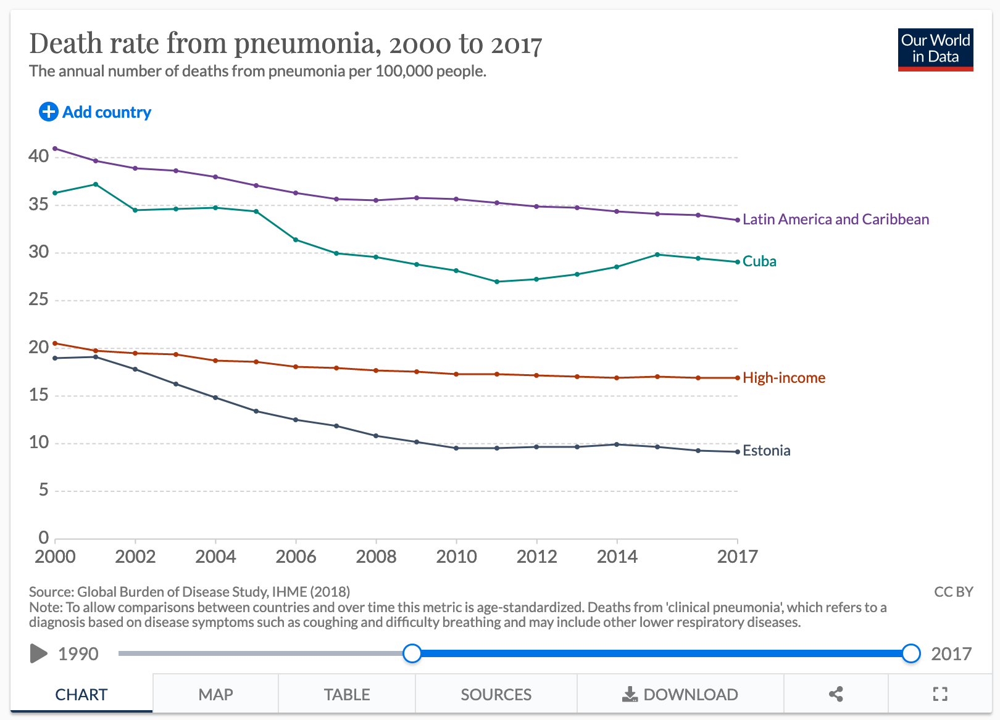

**Entrega:** Enviar la carpeta que el codigo de solución (.Rmd y funciones
auxiliares) a mas tardar el 15 de Diciembre antes de las 12:00pm (mediodia), por
correo electrónico con el título fundamentos-final, un solo documento por
equipo. No se aceptarán entregas extemporáneas. Será mejor entregar un examen resuelto parcialmente, que no entregar nada.

**Instrucciones:**
  
* Tus respuestas deben ser claras y debes explicar los resultados, incluye
también tus procedimientos/código de manera ordenada, y el código comentado.

* Se evaluará la presentación de resultados (calidad de las gráficas, tablas,...), revisa la sección de visualización en las notas.

* Las sesiones del Martes 8 y Jueves 10 de Diciembre a las 10 am, serán espacios para resolver dudas que puedan surgir del exámen.

* No pueden compartir soluciones entre diferentes equipos, o alumnos del grupo 001 de esta misma materia.

* Al entregar este examen afirmas que el trabajo se realizó sólo con tu
compañero de equipo. El material que utilizaste para apoyarte consistió de las notas en clase (pdf en canvas), el codigo fuente de las notas en el repositorio de Github.

* Al entregar estás dando tu consentimiento para que bajo sospecha y suficiente evidencia de copia se anule tu evaluación.

# Preparación de ambiente

Asegurate de tener instalado los paquetes que usamos más en las notas del curso. 
En particular, si usas `renv` como manejador de ambientes puedes instalarlos con las instrucciones de abajo. Sólo necesitarías descomentarlas.

```{r, echo = TRUE}
# renv::install("tidyverse")
# renv::install("patchwork")
# renv::install("nullabor")
# renv::install("scales")
# renv::install('diegovalle/mxmaps')
# renv::install("nleqslv")
# renv::snapshot()

# Escribe las claves unicas de ambos miembros del equipo, para generar una
# semilla de numeros aleatorios.
claves_unicas <- c(150370, 2)
set.seed(min(claves_unicas))
```

  
```{r, echo=FALSE, message=FALSE, warning=FALSE}
library(tidyverse)
library(patchwork)
library(nullabor)
library(mxmaps)
library(scales)
library(nleqslv)
knitr::opts_chunk$set(echo = TRUE, message = FALSE, warning=FALSE, 
                      fig.align = 'center', cache=TRUE, fig.height = 3,
                      out.width =  "99%")
comma <- function(x) format(x, digits = 2, big.mark = ",")

source("utils.R")
```
 
 
# Modelos de conteo 

En el curso hemos estudiado las variables aleatorias Gaussianas para modelar eventos aleatorios compuestos de pequeños, pero controlados, efectos. También hemos utilizado variables aleatorias Binomiales para modelar tasas de éxito de algún evento binario de interés. En el contexto Bayesiano, hemos utilizado las distribuciones Beta, Gamma-Inversa, y Normal para realizar análisis conjugado con estos modelos. 

En este mini-proyecto, ilustraremos otra familia de distribuciones muy cómunes en la práctica. En particular, veremos la distribución **Poisson** como unmodelo de conteo. Es decir, una variable aleatoria Poisson nos sirve para modelar el número de ocurrencias de un evento en un periodo (tiempo) o área (espacio) base.

Decimos que $x|\theta \sim \textsf{Poisson}(\theta)$ si los eventos ocurren de manera independiente y a una tasa constante. La función de masa de probabilidad 
esta dada por

$$ p(X = k \, | \, \theta) = \frac{\theta^k \, e^{-\theta}}{k!},$$

donde sabemos que 

$$ \mathbb{E}[x|\theta] = \theta, \qquad  \mathbb{V}[x|\theta] = \theta $$

Al examinar la base de la función de masa de probabilidad notamos que un 
candidato para un anålisis conjugado es una distribución Gamma. Es decir, 
un candidato *natural* para una distribución previa para $\theta$ es 

$$\theta \sim \textsf{Gamma}(\alpha, \beta),$$

donde la densidad está dada por

$$ p(\theta) \propto \theta^{\alpha - 1} \, e^{-\beta \, \theta},$$

y tenemos los siguientes momentos 

$$\mathbb{E}[\theta] = \frac\alpha\beta, \qquad  \mathbb{V}[\theta] = \frac{\alpha}{\beta^2}.$$ 

---

**Pregunta 1)** Para una muestra $X_1, \ldots, X_n \overset{iid}{\sim} \textsf{Poisson}(\theta),$ determina la distribución posterior de $\theta,$ y calcula media y varianza de la distribución posterior. ¿Podríamos escribir la media posterior como un promedio ponderado entre datos e información previa? ¿Cómo interpretas los hiper-parámetros $(\alpha, \beta)?$

$$
\begin{align}
\Pi (\theta \mid x_1 , \dots, x_n) 
&\propto \Pi (x_1, \dots, x_n \mid \theta) \cdot \Pi (\theta) \\
&\propto \prod_i{\Pi(x_i \mid \theta)} \cdot \Pi(\theta) \\
&\propto \prod_i{\frac{\theta^{x_i} e^{-\theta}}{x_i!}} \cdot \theta^{\alpha-1}e^{-\beta \theta} \\
&\propto \frac{\theta^{\sum{x_i}}e^{-n\theta}}{\prod{x_i!}} \cdot \theta^{\alpha-1}e^{-\beta \theta} \\
&\propto \theta^{\alpha + \sum{x_i} - 1}e^{-\theta(\beta + n)}
\end{align}
$$
De lo anterior se puede ver que 

$$
\Pi (\theta \mid x_1 , \dots, x_n)\sim Gamma(\alpha + \sum{x_i}, \beta + n)
$$
Así,

$$
E[\theta \mid x_1 , \dots, x_n] = \frac{\alpha + \sum{x_i}}{\beta + n} \\
Var[\theta \mid x_1 , \dots, x_n] = \frac{\alpha + \sum{x_i}}{(\beta + n)^2} 
$$
Sí se puede ver como un promedio entre los datos y el parámetro $\alpha$. Entre más datos sean más peso tendrán en la posterior. En cambio si los datos $n \to 0$, la posterior será igual a la distribución a priori.

---

Otra variable aleatoria de conteo relevante es la **Binomial Negativa.** Esta distribución sirve para modelar el número de éxitos en una secuencia de experimentos Bernoulli antes de encontrar un número específico de fracasos. 

Decimos que $X|\alpha, \beta \sim \textsf{Neg-Bin}(\alpha, \beta),$ donde $X$ es el número de éxitos que contamos antes de $\alpha$ fracasos, cuando cada fracaso ocurre con probabilidad $\frac{\beta}{\beta + 1}.$ La función de masa de probabilidad se escribe

$$ p(X = k \, | \, \alpha, \beta) = {\alpha + k -1 \choose k} \left(\frac{\beta}{\beta + 1}\right)^\alpha \left(\frac{1}{\beta + 1}\right)^k.$$

Nota que 
$${\alpha + k -1 \choose k} = {\alpha + k -1 \choose \alpha -1},$$
es decir, el número de formas que puedes acomodar $\alpha - 1$ fracasos es igual al número de formas que puedes acomodar $k$ éxitos cuando realizaste $\alpha + k-1$ experimentos y todos los experimentos son independientes. Por otro lado, la definición es
$${\alpha + k -1 \choose k} = \frac{(\alpha + k - 1)!}{k! \, (\alpha - 1)!}.$$
donde $k! = k \times k-1 \times k-2 \times \cdots \times 1,$ y la función Gamma satisface $$\Gamma(\alpha) = (\alpha - 1)!.$$

---

**Pregunta 2)** Bajo el modelo conjugado que escribiste en la pregunta 1, calcula 
la **distribución predictiva previa** para una observación Poisson. Es decir, calcula 
$$p(y) = \int \textsf{Poisson}(y \,| \,\theta) \textsf{Gamma}(\theta \, | \, \alpha, \beta) \, \text{d}\theta.$$


$$
\begin{align}
p(y) &= \int_0^{\infty} \frac{\theta^y e^{-\theta}}{y!} \cdot
\frac{\beta^\alpha \theta^{\alpha-1} e^{-\beta \theta}}{\Gamma(\alpha)} d\theta \\
&= \frac{\beta^\alpha}{\Gamma(\alpha)y!} 
\int_0^\infty\theta^{y+\alpha -1}e^{-\theta(\beta +1)}d\theta
\end{align}
$$
Sabemos que:
$$ \Gamma(z) = \int_0^\infty t^{z-1}e^{-t}dt$$
Entonces si:

$$
t = \theta(\beta +1)\\
\Rightarrow \theta = \frac{t}{\beta +1} \\
d\theta = \frac{1}{\beta +1}dt
$$
Así:
$$
\begin{align}
&= \frac{\beta^\alpha}{\Gamma(\alpha)y!} 
\int_0^\infty\frac{t}{\beta +1}^{y+\alpha -1}e^{-t} \frac{1}{\beta +1}dt \\
&= \frac{\beta^\alpha}{\Gamma(\alpha)y!}\cdot\frac{1}{(\beta+1)^{y+\alpha}} \int_0^\infty t^{y+\alpha -1}e^{-t}dt \\
&= \frac{\beta^\alpha}{\Gamma(\alpha)y!}\cdot\frac{1}{(\beta+1)^{y+\alpha}} \Gamma(y+\alpha) \\
&= \frac{\Gamma(y+\alpha)}{\Gamma(\alpha)y!}  \frac{\beta^\alpha}{(\beta+1)^{y+\alpha}} \\
&=\frac{(y+\alpha-1)!}{(\alpha-1)!y!} \left(\frac{\beta}{\beta+1}\right)^\alpha \left(\frac{1}{\beta+1}\right)^y \\
&=\binom{y+\alpha-1}{y} \left(\frac{\beta}{\beta+1}\right)^\alpha \left(\frac{1}{\beta+1}\right)^y
\end{align}
$$


Verifica tu cálculo utilizando las reglas probabilidad condicional. En especifico, utiliza

$$ p(y) = \frac{p(y|\theta)p(\theta)}{p(\theta|y)}.$$
Tenemos que:

$$
\begin{align}
p(y) &= \frac{ \frac{\theta^y e^{-\theta}}{y!} \frac{\beta^\alpha\theta^{\alpha-1}e^{-\beta\theta}}{\Gamma(\alpha)}}
{\frac{(\beta+1)^{\alpha+y}\theta^{\alpha+y-1}e^{-(\beta+1)\theta}}{\Gamma(\alpha+y)}} \\
&= \frac{\Gamma(\alpha+y)}{\Gamma(\alpha)y!} \frac{\beta^\alpha}{(\beta+1)^{\alpha + y}}\theta^0e^0 \\
&=\frac{(y+\alpha-1)!}{(\alpha-1)!y!} \left(\frac{\beta}{\beta+1}\right)^\alpha \left(\frac{1}{\beta+1}\right)^y \\
&=\binom{y+\alpha-1}{y} \left(\frac{\beta}{\beta+1}\right)^\alpha \left(\frac{1}{\beta+1}\right)^y
\end{align}
$$
¿Qué distribución marginal tiene $y$ bajo el modelo conjugado?

Es una distrubución binomial negativa, por lo tanto
$$ p(y) \sim BinNeg(\alpha,\beta)$$

---

En la práctica, es útil extender el modelo Poisson como sigue
\begin{align}
  x_i | t_i, \theta &\sim \textsf{Poisson}(\lambda_i), \\
  \lambda_i &= t_i \theta, 
\end{align}

donde la tasa de ocurrencia $\lambda_i$ ha sido descompuesta en un producto que incorpora la exposición $t_i$ y una tasa de ocurrencia por unidades expuestas $\theta.$ En este contexto usualmente tenemos observaciones para $x_i$ y $t_i$ pues conocemos el parámetro de exposición. Por ejemplo, si $x_i$ es el número de personas que se enferman de gripe en la $i$-ésima ciudad en un año, entonces $\theta$ denota la tasa anual por persona de enfermarse de gripe en una población de tamaño $t_i$.

**Pregunta 3)** Supongamos que tenemos datos $X_1, \ldots, X_n \sim
\textsf{Poisson}(\lambda_i),$ con $\lambda_i = t_i \theta$ para $i = 1, \ldots, n.$ Utilizando el modelo conjugado, ¿cuál es la distribución posterior de $\theta?$


$$
\begin{align}
\Pi (\theta \mid x_1 , \dots, x_n) 
&\propto \Pi (x_1, \dots, x_n \mid \theta) \cdot \Pi (\theta) \\
&\propto \prod_i{\Pi(x_i \mid \theta)} \cdot \Pi(\theta) \\
&\propto \prod_i{\frac{(\theta t_i)^{x_i} e^{-\theta t_i}}{x_i!}} \cdot \theta^{\alpha-1}e^{-\beta \theta} \\
&\propto \theta^{\sum{x_i}}e^{-\theta\sum t_i} \cdot \theta^{\alpha-1}e^{-\beta \theta} \\
&\propto \theta^{\alpha + \sum{x_i} - 1}e^{-\theta(\beta + \sum t_i)}
\end{align}
$$

Por lo tanto, la distribución posterior es:
$$
\Pi (\theta\mid x_1 ,\dots,x_n)\sim Gamma(\alpha + \sum{x_i}, \beta + \sum t_i)
$$

---

# Caso de estudio: Tasas de mortalidad

El INEGI publica para cada año los registros de fallecimiento junto con la causa
principal de muerte. En esta sección utilizaremos los modelos descritos
anteriormente para inferir tasa de fallecimiento por Neumonía para cada uno de
los municipios/delegaciones del país. Contamos con los últimos 5 años de los
registros de defunción.

---

### Carga y preparación de datos


**Pregunta 4)** Empecemos explorando los datos. Carga los datos para un año que
elijas. Encontrarás en los archivos en `datos/poblacion/defunciones/<año>` los
registros de defunciones por Neumonía para el `<año>` que escojas.

```{r carga defunciones de un año, message=FALSE}
defunciones <- read_csv("./datos_examen/poblacion/defunciones/2019/defunciones_registradas.csv")


str(defunciones)
map_int(defunciones[,1:5], ~length(unique(.x)) )

```

* El dataset contiene $5$ variables y tenemos un total de $30,327$ observaciones.

* Observemos que tenemos $33$ entidades, lo cual hace un poco de ruido, ya que, la República Mexicana está constituída por $32$ entidades federativas.

* En el dataset se tiene información de $314$ municipios, de acuerdo a informaicón declarada por el [INEGI](http://cuentame.inegi.org.mx/territorio/division/default.aspx?tema=T#:~:text=Para%20gobernar%2C%20organizar%20y%20administrar,todo%20el%20pa%C3%ADs%202%20457.) hay un total de $2,465$ municipios, por lo que nuestra muestra contiene aproximadamente el $12\%$ de ellos.

* Para el sexo aparecen $3$ categorías (intuitivamente diríamos que es Masculino, Femenino y No declarado).

* Tenemos $7$ grupos de edad, los cuales son los siguientes:

```{r defunciones por edad}
defunciones$edad_grupos %>% unique
```


* $[3, 6)$
* $[6, 12)$
* $[12, 18)$
* $[18, 25)$
* $[25, 64)$
* $[64, \inf)$

Para el tema de los $33$ estados analicemos los valores:
```{r defunciones por estado}
defunciones$entidad %>% unique() %>% sort()
```
Nótese que se tiene una entidad $99$, que por intuición indicaríamos que es una Entidad no identificada.

Y ahora para la variable sexo:
```{r defunciones por genero}
defunciones$sexo %>% unique() %>% sort()
```

Nuestra hipótesis era casi correcta, tenemos un tercer sexo el cual es NaN, que indica nos sugiere que el usuario no se identificó con alguno de los 2 sexos o bien, no quiso declarar esa información.

Ahora anilcemos un poco la variabilida de los datos.

```{r grafica defunciones por año}
defunciones %>% 
  ggplot(data = ., aes(x = edad)) +
  geom_boxplot(aes(color = sexo)) +
  ggtitle('Edad por sexo declarado') +
  xlab('Edad') +
  ylab('Frecuencia relativa') +
  ggthemes::theme_base()

defunciones %>% colnames()
```
Es difícil analizar la dispersión de las edades por sexo debido a la existencia de $2$ valores atípicos, los cuales equivalen a la edad $1000$ años, lo cual no hace sentido, pues no existe ningún registro de una persona en la historia de la humanidad que haya sobrevivido a $1,000$ años. Suponemos que para dichas observaciones el individuo no quiso declarar su edad o bien hubo un  error en el registro de la captura del dato. A continuación analizaremos las edades sin dichos valores.

```{r defunciones sin atipicos}
defunciones %>% 
  filter(edad < 250) %>% 
  ggplot(data = ., aes(x = edad)) +
  geom_boxplot(aes(color = sexo)) +
  ggtitle('Edad filtrada por sexo declarado') +
  xlab('Edad') +
  ylab('Frecuencia relativa') +
  ggthemes::theme_base()
```

Realizando el filtro correspondiente es un poco más "sencillo" (es una palabra que no nos gusta utilizar, ya que es relativo a la persona) analizar la dispersión de la edad para las personas:
* La mediana de edad para mujeres es mayor que para los hombres, sin embargo, ambas distribuciones son muy similares.
* Para el sexo no declarado la edad únicamente es 0, por lo que, para dichas observaciones el individuo no quiso declarar su sexo ni edad.


En relación a la variable `entidad`, estos son nuestros comentarios:
```{r defunciones por entidad}
defunciones %>% 
  select(entidad) %>% 
  table() %>% 
  sort(decreasing = TRUE)
```
Es difícil saber qué Estado representa cada número, ya que, no se cuenta con un diccionario de datos. Por ahora solamente se puede indicar que el estado $9$, es el que tiene un mayor peso en el dataset.


**Pregunta 5)** De igual forma, carga los datos de población que encontrarás en
`datos_examen/poblacion/demograficos`. Por el momento, no necesitamos los grupos
de edad (aunque despúes los utilizaremos). Por ahora escribe el codigo necesario 
para calcular el tamaño de la población en cada uno de los municipios.


```{r carga demograficos, message=FALSE}
poblacion <- read_csv("./datos_examen/poblacion/demograficos/poblacion_municipios_edad.csv")

poblacion <- poblacion %>% 
  mutate(poblacion = p_0a2+p_3a5+p_6a11+p_12a17+p_18a24+p_25a64+pob65_mas)

```

**Pregunta 6)** Ahora necesitamos *cruzar* las tablas de defunciones y población para crear una tabla con ambos registros. Para esto necesitarás la función `dplyr::full_join`.


```{r cruce defunciones y poblacion, message=FALSE}
# Primero se agrupan los datos de defunciones por municipio
defunciones_mun <- defunciones %>% 
  group_by(entidad, municipio) %>% 
  count(name = 'defunciones')

datos = poblacion %>% 
  left_join(defunciones_mun, by=c('entidad', 'municipio'))

```

**Pregunta 7)** Con esto tendrás conocimiento de cómo cargar la información
relevante (número de defunciones y población total en cada municipio). Sin
embargo, tenemos información para las defunciones de los últimos 5 años. Carga
la información que encontrarás en `/defunciones/` y agrupa de tal forma que
tengas una tabla como la anterior. **Importante: ** Para fines de este proyecto
no necesitamos los conteos por año, sólo el agrupado. Es decir, el número de
defunciones totales de los 5 años por municipio.


```{r carga masiva, message = FALSE, warning = FALSE}
# En la funcion cargar_defunciones, en caso de error
# Por favor escribir como parámetro la dirección donde se entuentran 
# los archivos de defunciones (ej: "./datos_examen/poblacion/defunciones/")
defunciones <- cargar_defunciones()

defunciones_mun <- defunciones %>% 
  group_by(entidad, municipio) %>% 
  count(name = 'defunciones')

datos = poblacion %>% 
  left_join(defunciones_mun, by=c('entidad', 'municipio')) %>% 
  replace_na(list(defunciones=0))
```


--- 

### Cáclulo de estadístico de interés

Lo que nos interesa en particular son las tasas de mortalidad anual en los
municipios del país. Para esto utilizaremos el modelo Poisson que vimos en la
primera parte. Si denotamos por $y_i$ el número total de defunciones por neumonia
en el $i$-ésimo municipio; $\theta_i,$ la tasa de mortalidad por individuo por
año, entonces 

$$ y_i \, | \, n_i, \theta_i \sim \textsf{Poisson}(\lambda_i),$$

donde $n_i$ denota la población total del municipio $i$-ésimo y 
$\lambda_i$ la tasa con la que ocurren las  muertes por neumonía en el periodo
observado para la población del municipio $i$-ésimo.

**Pregunta 8)** ¿Cómo escribirías $\lambda_i$ en función de $\theta_i$?

$$\lambda_i = n_i\theta_i$$

Ahora, utilizaremos un mapa para ver si podemos observar algún patrón en las
tasas de mortalidad por individuo por año $\theta_i.$ Por ejemplo, podríamos
esperar que algunas zonas del país concentren las tasas mas altas. Por ejemplo,
podemos crear mapas con los municipios con las tasas mas bajas y altas. Digamos
que sólo queremos ver el 25\% mas bajo y alto. Los mapas los obtenemos con las
funciones `mxmaps::mxmunicipio_choropleth`.

La estructura que necesita esta función es una tabla con una columna que se 
llame `region` donde venga el codigo identificador del municipio. Por ejemplo, 
para el municipio `001` en el estado `24` el codigo de region será `24001`. Otra 
columna necesaria es el valor con el que "coloreará" el municipio en el mapa y
se tiene que llamar `value` y puede ser una variable `Boolean` o `double`. 

**Pista.** Para este punto, podrías necesitar la función `dplyr::row_number`. De
igual forma podrías ocupar una indicadora para decir cuáles son los municipios
con las tasas mas altas y cuáles son los que tienen las mas bajas. Al final,
podrías presentar esto como dos mapas separados.


```{r, eval=FALSE}
datos %>% 
  mutate(region = paste(entidad,municipio, sep=""),
         value = defunciones/poblacion) %>% 
  mxmunicipio_choropleth()

```

```{r}
datos <- datos %>% 
  mutate(region = paste(entidad,municipio, sep=""),
         mortalidad = ((defunciones/5)/poblacion), 
         orden = row_number(mortalidad)/nrow(datos),
         value = ifelse(orden<0.75,
         ifelse(orden<0.25,"1_Menos_casos","2_Med"),
         "3_Mas_casos"))

mxmunicipio_choropleth(datos)

```
¿Qué observas? No hay patrón tan claro. Especialmente si observamos lo que
sucede en Chihuahua, Durango y Coahuila, donde tenemos municipios de ambas
categorías. ¿Cómo puede ser que un mismo estado tenga las tasas mas altas y
bajas al mismo tiempo?

¡El problema es el tamaño de muestra! Considera un municipio de 1,000
habitantes. Muy probablemente en 5 años no veamos una muerte por neumonía, lo
cual convertiría la tasa observada en 0. Sin embargo, si ocurriera una muerte
entonces la tasa sería de 1/5,000 por año, lo cual sería muy elevado con
respecto a otros municipios con poblaciones grandes y mayor número de casos.

## Inferencia Bayesiana para tasa de mortalidad

Utilizaremos inferencia Bayesiana para regularizar el problema. Seguiremos 
suponiendo que 

$$ y_i \, | \, n_i, \theta_i \sim \textsf{Poisson}(\lambda_i),$$

pero ahora necesitamos una distribución previa para $\theta_i.$ Sabemos, por lo
anterior, que el modelo Poisson-Gamma es conjugado. Por lo tanto requerimos una
distribución Gamma. Sólo falta elicitar los hiperparámetros. 

No todos somos expertos en salud ni tenemos conocimiento previo. Sin embargo,
podemos visitar esta [página](https://ourworldindata.org/pneumonia) para darnos
una idea de las tasas de mortalidad por neumonía en el resto del mundo.

A continuación se muestra las tasas de mortalidad para los últimos años para
algunos paises y la region de America Latina y el Caribe.

```{r, echo = FALSE}

```

Considera los siguientes puntos: 
  
  - Las tasas anteriores han sido calculadas con un método que incorpora la
  estructura demográfica de cada país y la estandariza con respecto a la
  pirámide poblacional mundial. En nuestro ejemplo, nuestras tasas no serán
  ajustada de tal forma (este método se conoce en inglés como *age-standarized
  mortality rates*).
  - Las tasas reportadas tienen una base distinta, pues son reportadas con respecto
  a una población de 100,000 habitantes. Es decir, son tasas de mortalidad
  anuales para poblaciones de 100K habitantes. Por ejemplo, un valor de 5
  significa que en promedio 5 habitantes por cada 100K mueren de neumonia al
  año.
  
**Pregunta 9)** Con esto en mente, escribe los límites necesarios para encontrar
una distribución Gamma adecuada. Encuentra la solución al sistema de ecuaciones
no lineales por medio de la función `nleqslv::nleqslv`. Escribe tu razonamiento 
para seleccionar dichos valores. 

```{r elicitacion}
limits <- c(1.12/100000,180/100000)# escribe los intervalos adecuados aqui
#limits <- c(.5, .99)

gamma.limits <- function(x){
  # reparametrizamos para que el problema sea mas "fácil" en términos numéricos.
  log_alpha <- x[1]
  log_beta  <- x[2]
  
  # definimos las cotas de probabilidad
  p_cota <- 0.01# define un valor adecuada
  c(    pgamma(limits[1], exp(log_alpha), rate = exp(log_beta)) - p_cota,
    1 - pgamma(limits[2], exp(log_alpha), rate = exp(log_beta)) - p_cota)
}

initial_guess <- c(log(1), log(1))

results <- nleqslv(initial_guess, gamma.limits)

params.prior <- exp(results$x)
#params.prior <- results$x

```

**Pregunta 10)** Grafica los histogramas de una variable aleatoria Gamma con los valores iniciales para el problema de optimización y con los finales de dicho algorimo. Esto te servirá de verificación que el método funciona adecuadamente.

```{r histogramas elicitacion}

gamma_inicial <- rgamma(10000,initial_guess[1],initial_guess[2])
gamma_final <- rgamma(10000,params.prior[1],params.prior[2])

df_gamma <- data.frame(
  type = c( rep("inicial", 10000), rep("final", 10000)),
  value = c(gamma_inicial,gamma_final)
)

df_gamma %>%
  ggplot(aes(x=value,fill=type)) +
  geom_histogram(color="#e9ecef", alpha=0.6, position = 'identity',bins=50) +
  scale_fill_manual(values=c("#69b3a2", "#404080")) +
  labs(fill="")

```

**Pregunta 11)** ¿Cómo se compara la distribución a priori con las tasas
observadas en los municipios? Puedes utilizar histogramas para estas
comparaciones. Por otro lado, no te preocupes si no se ven identicas. El punto es ver que nuestras creencias iniciales se ven coherentes. 

```{r}

hist1<-data.frame('value'=datos$mortalidad)
hist1$type <- 'observada'

hist2<-data.frame('value'=df_gamma %>%filter(type=='final')%>%select(value))
hist2$type <- 'gamma_apriori'

hist <- rbind(hist1,hist2)

hist %>%
  ggplot(aes(x=value,fill=type)) +
  geom_histogram(color="#e9ecef", alpha=0.6, position = 'identity') +
  scale_fill_manual(values=c("#69b3a2", "#404080")) +
  labs(fill="")


```

**Pregunta 12)** Utiliza un gráfico de dispersión para comparar las tasas
observadas contra la población del municipio. ¿Qué observas? Utiliza los ejes en
escala logaritmica. Para esto checa la función: `ggplot2::scale_x_log10` y
`ggplot2::scale_y_log10`

```{r}
datos %>%
  ggplot(aes(x=mortalidad,y=poblacion)) +
  geom_point()

datos %>%
  ggplot(aes(x=mortalidad,y=poblacion)) +
  geom_point() +
  scale_x_log10() +
  scale_y_log10()

```

**Pregunta 13)** Ahora usaremos la distribución predictiva **previa** para explorar 
los posibles valores que tendrían los casos de muerte bajo nuestro modelo para
municipios de distintos tamaños. Para este punto considera que la predictiva es 
una mezcla de Poisson con Gamma, como se expresa en

$$p(y) = \int \textsf{Poisson}(y | n, \theta) \, \textsf{Gamma}(\theta|\alpha, \beta) \, \text{d}\theta,$$

o bien, la forma en especifico de la predictiva preevia. ¡Esto ya lo has
resuelto en la primera parte del examen!

Usa histogramas  para ver los números de muertes en municipios hipotéticos de
tamaño $n = 10^3, 10^4, 10^5.$

```{r}
n = 1000

# sim_binom <- function(n, params.prior){
#   rnbinom(n,
#           size=params.prior[1],
#           prob=(params.prior[2]/(params.prior[2]+1))) %>% 
#     sum()
# }

# muer_103 <- rerun(n, sim_binom(1000,params.prior)) %>% as_vector()
# muer_104 <- rerun(n, sim_binom(10000,params.prior)) %>% as_vector()
# muer_105 <- rerun(n, sim_binom(100000,params.prior)) %>% as_vector()

muer_103 <- rnbinom(n, 
                    size=1000*params.prior[1],
                    (params.prior[2]/(params.prior[2]+1)))
muer_104 <- rnbinom(n, 
                    size=10000*params.prior[1],
                    (params.prior[2]/(params.prior[2]+1)))
muer_105 <- rnbinom(n, 
                    size=100000*params.prior[1],
                    (params.prior[2]/(params.prior[2]+1)))

df_hist <- data.frame(
  type = c( rep("10^3", n), rep("10^4", n),rep("10^5", n)),
  value = c(muer_103,muer_104,muer_105)
)

df_hist %>%
  ggplot(aes(x=value,fill=type)) +
  geom_histogram(color="#e9ecef", alpha=0.6, position = 'identity') +
  scale_fill_manual(values=c("#69b3a2", "#404080",'504080')) +
  labs(fill="") +
  facet_grid(cols = vars(type))


```

**Pregunta 14)** Calcula los valores posteriores de las tasas de mortalidad bajo nuestro modelo bayesiano y compara con los estimadores de máxima verosimilitud. Para esto puedes utilizar un gráfico de dispersión cómo el visto en clase o los anteriores. ¿Observas regularización en nuestras estimaciones? ¿Qué observas si haces un grafico como el de la pregunta 12? ¿Observas regularización en nuestras estimaciones? Para este punto, utiliza las tasas observadas (MLE) y las tasas esperadas posteriores (MAP).

```{r}
pars_post <- function(num_muertes , tam_pob, params.prior){
  
  # Parametros iniciales
  alpha_prior <- params.prior[1]
  beta_prior <- params.prior[2]
  
  # Parámetros
  alpha_post <- alpha_prior + num_muertes
  
  # beta post
  beta_post <- beta_prior + tam_pob
  
  beta_post
  # Simulacion
  rgamma(1, alpha_post, rate=beta_post)
  }

```


```{r}
#pars_post = Vectorize(pars_post)
vec_gamma = Vectorize(rgamma)
# x <- datos %>%
#   mutate(theta_post = pars_post(defunciones, poblacion, params.prior))
datos <-  datos %>%
  mutate(alpha_post = params.prior[1] + defunciones,
         beta_post = params.prior[2] + poblacion,
         theta_post = vec_gamma(1,alpha_post,beta_post))
```

```{r}
ggplot(datos) +
  geom_point(aes(x=mortalidad, y = theta_post))
```


```{r}
update_parm <- function(num_muertes , tam_pob, params.prior){
  
  # Parametros iniciales
  alpha_prior <- params.prior[1]
  beta_prior <- params.prior[2]
  
  # Parámetros
  alpha_post <- alpha_prior + sum(num_muertes, na.rm=TRUE)
  
  # beta post
  beta_post <- beta_prior + sum(tam_pob, na.rm=TRUE)
  return(c(alpha_post, beta_post)) }

pars_post <- update_parm(datos$defunciones,
                                     datos$poblacion,
                                     params.prior)

sim_params <- function(m, pars){
  alpha_0 <- pars[1]
  beta_0 <- pars[2]
  # simular sigmas
  sims <- tibble(theta = rgamma(m, alpha_0, beta_0))
  }

post_mort <- sim_params(1000,pars_post)

#post_mort %>%
#  ggplot(aes(x=theta)) +
#  geom_histogram(color="#e9ecef", alpha=0.6, position = 'identity') +
#  scale_fill_manual(values=c("#69b3a2")) +
#  labs(fill="") #+
#  #geom_vline(xintercept = mean(rat_mort$value,na.rm=TRUE))

post_hist1<-data.frame('value' = datos$mortalidad)
post_hist1$type <- 'observada'

post_hist2<-data.frame('value'=post_mort)
post_hist2$type <- 'posterior'
names(post_hist2)[1] <- "value"

post_hist <- rbind(post_hist1, post_hist2)

post_hist %>%
  ggplot(aes(x=value,fill=type)) +
  geom_histogram(color="#e9ecef", alpha=0.6, position = 'identity') +
  scale_fill_manual(values=c("#69b3a2","#404080")) +
  labs(fill="")# +
  #geom_vline(xintercept = mean(rat_mort$value,na.rm=TRUE)) +
  #geom_vline(xintercept = mean(post_mort,na.rm=TRUE))

post_hist %>%
  filter(type == 'observada') %>% 
  ggplot(aes(x=value,fill=type)) +
  geom_histogram(color="#e9ecef", alpha=0.6, position = 'identity') +
  scale_fill_manual(values=c("#69b3a2","#404080")) +
  labs(fill="")# +
  #geom_vline(xintercept = mean(rat_mort$value,na.rm=TRUE)) +
  #geom_vline(xintercept = mean(post_mort,na.rm=TRUE))

post_hist %>%
  filter(type == 'posterior') %>% 
  ggplot(aes(x=value,fill=type)) +
  geom_histogram(color="#e9ecef", alpha=0.6, position = 'identity') +
  scale_fill_manual(values=c("#69b3a2","#404080")) +
  labs(fill="")# +
  #geom_vline(xintercept = mean(rat_mort$value,na.rm=TRUE)) +
  #geom_vline(xintercept = mean(post_mort,na.rm=TRUE))

post_hist %>%
  group_by(type) %>%
  summarise(media=mean(value,na.rm=TRUE),desest=sd(value,na.rm=TRUE),n=n())

```

**Pregunta 15)** Utiliza la distribución predictiva *posterior* para verificar
el ajuste del modelo. Para esto, escoge tres municipios al azar de distintos
tamaños (chico, mediano, grande). Grafica un histograma y compara con el número observado de defunciones.

```{r}
datos %>% 
  filter(region == '20335' | region=='14020' | region=='01005') %>% 
  mutate(orden = row_number(poblacion), 
         tamano = factor(ifelse(orden==1, 
                         "chico", 
                         ifelse(orden==2, "mediano", "grande")),
                         levels = c("chico", "mediano", "grande"))) %>% 
  pivot_longer(cols=c(mortalidad, theta_post),
               names_to = "estimador", values_to = "values") %>% 
  ggplot() +
  geom_col(aes(x=tamano, y=values, fill=estimador), position = "dodge") +
  scale_fill_discrete(labels = c("EMV", "MAP"))

```


## Incorporando Grupos de Edad

Se sabe que las muertes por neumonia no son uniformes y las tasas de mortalidad son mas altas en niños y personas mayores. Ahora realizaremos el mismo análisis considerando grupos de edad. Para esto ampliaremos nuestro modelo

$$ y_{k,i} \, | \, n_{k,i}, \theta_{k,i} \sim \textsf{Poisson}(\lambda_{k,i}),$$

donde utilizamos el sub-indice $k,i$ para denotar el $k$-ésimo grupo de edad en
el $i$-ésimo municipio.

**Pregunta 16)** Genera histogramas para cada grupo de edad y discute si el
supuesto anterior esta soportado por los datos. Para esto calcula las tasas de mortalidad adecuadas. Auxiliate de `ggplot2::facet_wrap`.

Por motivos de simplicidad usaremos la misma distribución previa para cada tasa de mortalidad asociada a grupos de edad y municipio que en los puntos anteriores. 


```{r}
datos_edad <- poblacion %>% 
    select(entidad, municipio, p_0a2:pob65_mas) %>% 
  pivot_longer(p_0a2:pob65_mas, 
               names_to = "GrupoEdad",
               values_to = "Poblacion") %>% 
  left_join(defunciones %>% 
  group_by(entidad, municipio, edad_grupos) %>% 
  count(name="Defunciones") %>% 
  mutate(GrupoEdad = recode(edad_grupos,
                            "[0,3)"="p_0a2",
                            "[3,6)"="p_3a5",
                            "[6,12)"="p_6a11",
                            "[12,18)"="p_12a17",
                            "[18,25)"="p_18a24",
                            "[25,64)"="p_25a64",
                            "[64,Inf]"="pob65_mas")),
  by=c('entidad', 'municipio', 'GrupoEdad' )) %>% 
  mutate(Defunciones = replace_na(Defunciones, 0),
    mortalidad = Defunciones/Poblacion,
    GrupoEdad = factor(GrupoEdad, 
                       levels = c("p_0a2","p_3a5","p_6a11","p_12a17",
                                  "p_18a24","p_25a64","pob65_mas")))


```

Ahora la grafica

```{r}
datos_edad %>% 
  ggplot() +
  geom_histogram(aes(x=mortalidad), bins=40) +
  facet_wrap(vars(GrupoEdad))

datos_edad %>% 
  group_by(GrupoEdad) %>% 
  summarise(Poblacion = sum(Poblacion))
```
No necesariamente, el grupo de edad de más de 65 años no es tan numeroso y sus tasas son de las más algas

**Pregunta 17)** Utiliza graficos de dispersión para determinar si hay efectos de regularización. Las ideas las encuentras arriba en la pregunta 12 y 14.

```{r}
datos_edad <-  datos_edad %>%
  mutate(alpha_post = params.prior[1] + Defunciones,
         beta_post = params.prior[2] + Poblacion,
         theta_post = vec_gamma(1,alpha_post,beta_post))

```


**Pregunta 18)** Para uno de los tres municipios que escogiste anteriormente
utiliza la distribución predictiva posterior para verificar el ajuste del modelo para los grupos de edad: $[0,3), [18,25) \text{ y } [64, \infty).$ 

```{r}
datos_edad %>% 
  mutate(region = paste0(entidad, municipio)) %>% 
  filter(region == '20335' | region=='14020' | region=='01005') %>% 
  mutate(tamano = factor(ifelse(region=='20335',
                         "chico",
                         ifelse(region=='14020', "mediano", "grande")),
                         levels = c("chico", "mediano", "grande"))) %>%
  pivot_longer(cols=c(mortalidad, theta_post),
               names_to = "estimador", values_to = "values") %>%
  ggplot() +
  geom_col(aes(x=tamano, y=values, fill=estimador), position = "dodge") +
  scale_fill_discrete(labels = c("EMV", "MAP")) +
  facet_wrap(~GrupoEdad, scales="free")
```


## Conclusiones: 

¡El último modelo (edad-municipio) incorpora alrededor de 17K parámetros
distintos! Sin duda, no es parsimonioso. De hecho, este modelo representa el
extremo en complejidad para esta situación. Podemos incorporar una estructura jerárquica donde podemos interpretar una estructura multi-nivel en cuanto al conocimiento que podemos generar. Esto es por que en la estuctura de dependencia dejamos la misma distribucion previa sin importar municipio o grupo de edad. En cursos posteriores exploraremos estas opciones. Pero ahora, ¡a descansar!

